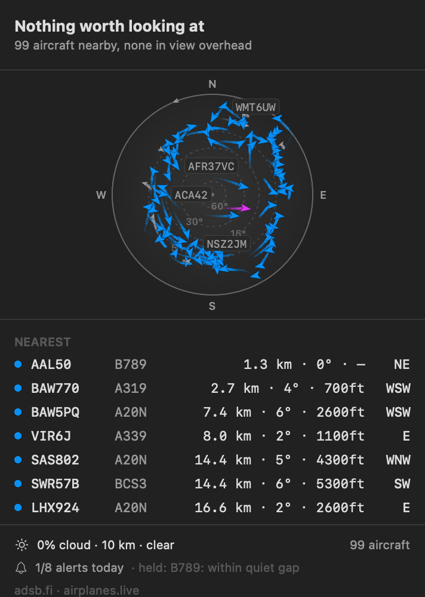
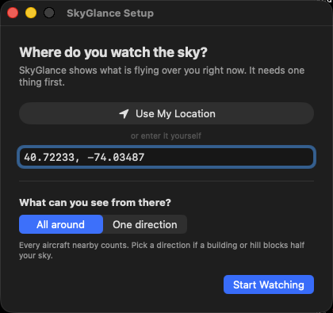

<div align="center">


# SkyGlance

**A macOS menu bar app that tells you what is flying over your head right now — and taps you on the shoulder when something worth looking up for is about to pass.**

No API key. No account. No subscription. Nothing to run in the background.



</div>

---

## What it does

**The count is always in your menu bar.** `✈ 23` means twenty-three aircraft within 60 nautical miles.
When something is actually overhead it says so — `✈ 23 · B738 55°` — and when one is inbound it
counts down: `✈ 23 · A320 25s`.

**The dome is the sky, not a map.** The centre is straight up, the rim is the horizon, north is up.
A map answers "where is it going"; this answers "where do I point my face". Aircraft are drawn as
glyphs rotated to their actual heading, with a trail showing where they came from — recorded from
real observations, not extrapolated.

The radial scale is deliberately non-linear. Measured over a real location, **42 of 42 aircraft sat
below 10° elevation**, which a linear projection crushes into the outer 11% of the disc. Here the
0–10° band gets the outer 46%, because that is where the traffic actually is.

**It interrupts you rarely, and honestly.** Four things earn an alert: rare or unusual types,
helicopters, anything big and low, and emergency squawks. A budget caps how often, with per-category
lanes so a busy morning of routine arrivals cannot spend the whole day and silently drop a 747 at
noon. If it is too dark or too overcast to see, the alert says *"passed overhead · too dark to see"*
rather than telling you to look at nothing.

**Tap an aircraft for the rest.** Operator, route, registration, and a photograph — roughly six in
seven aircraft resolve.

---

## Install

### Homebrew (recommended)

```bash
brew install --cask darshjoshi/tap/skyglance
xattr -dr com.apple.quarantine /Applications/SkyGlance.app
```

**Both lines are needed**, and the reason is worth stating plainly rather than hiding: SkyGlance is
signed ad-hoc, not notarised with a $99/year Apple Developer ID. macOS attaches a quarantine flag to
anything downloaded, and Gatekeeper refuses to open an un-notarised app while that flag is set. A
cask cannot clear it for you, and on current Homebrew the `--no-quarantine` flag is rejected outright
(`Error: invalid option`), so removing it afterwards is the only instruction that actually works.

Homebrew still earns its place: `brew upgrade` and `brew uninstall --zap skyglance` both work.

### Download the app

Grab `SkyGlance.app.zip` from [Releases](https://github.com/darshjoshi/skyglance-mac/releases),
unzip it, move it to `/Applications`, and clear the same flag:

```bash
xattr -dr com.apple.quarantine /Applications/SkyGlance.app
```

Without a terminal: double-click it, dismiss the warning, then open **System Settings → Privacy &
Security**, scroll to Security, click **Open Anyway** next to SkyGlance, authenticate, and launch it
again. (Apple removed the old Control-click → Open shortcut in macOS 15, so that no longer helps.)

### Build it yourself — no Gatekeeper friction at all

An app you compiled is never quarantined, so this path needs none of the above.

Needs Xcode 15 or newer.

```bash
git clone https://github.com/darshjoshi/skyglance-mac.git
cd skyglance-mac/app
./build-app.sh
open build/SkyGlance.app
```

> `swift run SkyGlance` **does not work.** It produces a bare executable with no `Info.plist`, and
> macOS refuses notifications to a process with no bundle identity. `build-app.sh` is the only
> supported path — the app will tell you so rather than crashing.

**Requires macOS 13 Ventura or newer.** Release builds are universal (Apple silicon and Intel).

---

## First run



SkyGlance asks two questions and then gets out of the way.

**Where you are.** Click *Use My Location*, or type coordinates. Nothing is sent anywhere — the
location is stored on your Mac and used only to work out the geometry.

**What you can see from there.** *All around* by default. Choose a direction if a building or a hill
blocks half your sky: aircraft outside the arc still appear, dimmed, but never trigger an alert.

Notifications are requested at the end of setup, not at launch, and if you decline the panel says so
instead of quietly counting alerts that were never delivered.

Both are changeable later from **Settings…** in the panel.

<br clear="right">

---

## How it works

Three independent ADS-B feeds are polled every three seconds and **merged**, not failed over —
unioned by ICAO hex with the freshest position winning. Measured, that is worth about 15% more
aircraft than any single source, and it means one going down is invisible to you.

Each source has its own rate limiter (1 req/sec) and a circuit breaker that opens for 30 seconds
after three consecutive failures. When everything is down the app says so; a quiet sky and a broken
app never render the same way. That principle is load-bearing here — most of the bugs found while
building this were a failure state that looked exactly like a normal one, and they are all written
up in [docs/ROADMAP.md](docs/ROADMAP.md).

Enrichment (routes, aircraft types, photographs) happens **only** when you select an aircraft or an
alert fires — never for a whole list on every poll — and results are cached permanently, including
misses.

More depth: [architecture](docs/ARCHITECTURE.md) · [the geometry](docs/OVERHEAD-DETECTION.md) ·
[the free stack](docs/FREE-STACK.md) · [what every source costs](docs/COVERAGE-AND-COST.md) ·
[the full landscape, paid and free](docs/RESEARCH.md)

---

## Data sources

Every one is free, keyless, and run by volunteers.

| Source | Provides | Terms |
|---|---|---|
| [adsb.lol](https://www.adsb.lol) | Live positions | **ODbL 1.0** — attribution required |
| [airplanes.live](https://airplanes.live) | Live positions | Non-commercial |
| [adsb.fi](https://adsb.fi) | Live positions | Community-run |
| [adsbdb.com](https://www.adsbdb.com) | Types and routes | Free |
| [hexdb.io](https://hexdb.io) | Types and routes (fallback) | Free |
| [planespotters.net](https://www.planespotters.net) | Photographs | Photographer credit required |
| [Open-Meteo](https://open-meteo.com) | Cloud cover and daylight | Free, non-commercial |

**If you fork this, be polite.** These are volunteer-run services with no SLA and no funding. Keep
the rate limiting, keep the caching, and put a real contact URL in the `User-Agent` — planespotters
rejects generic ones outright, which is the whole reason that string exists.

---

## Development

```bash
cd app
swift test              # 85 tests, fully offline and deterministic
./build-app.sh debug    # fast single-architecture build
```

There are no external package dependencies and the build needs no network.

A menu bar panel cannot be screenshotted on a sleeping or headless display, so the app can render
itself offscreen:

```bash
./build/SkyGlance.app/Contents/MacOS/SkyGlance --render out.png --dark \
    --at "51.4700, -0.4543" --warmup 150
```

`--at` polls somewhere else without touching your settings, and `--warmup` waits long enough for the
motion trails to accumulate — they are built from recorded polls and are invisible in a cold render.
The screenshot at the top of this page was made with exactly that command.

`reference/` holds a dependency-free Node implementation of the same architecture. The Mac app does
not use it and you do not need Node — see [reference/README.md](reference/README.md).

---

## Licence

[MIT](LICENSE) for the code. The flight data is not covered by it and carries its own terms — see
the table above, and the notice at the bottom of the licence file.
